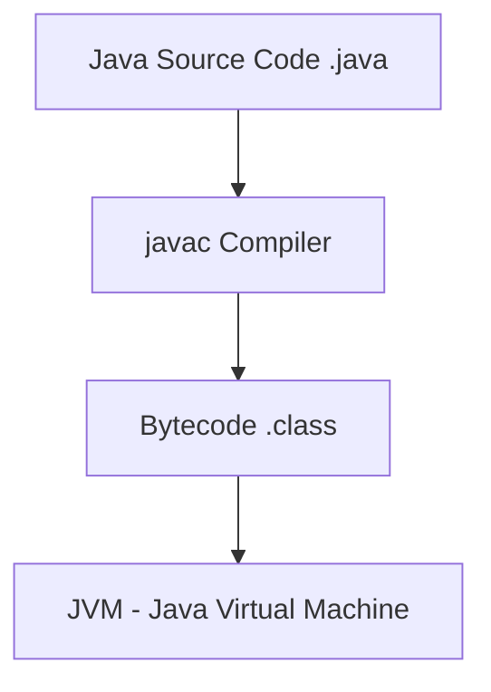
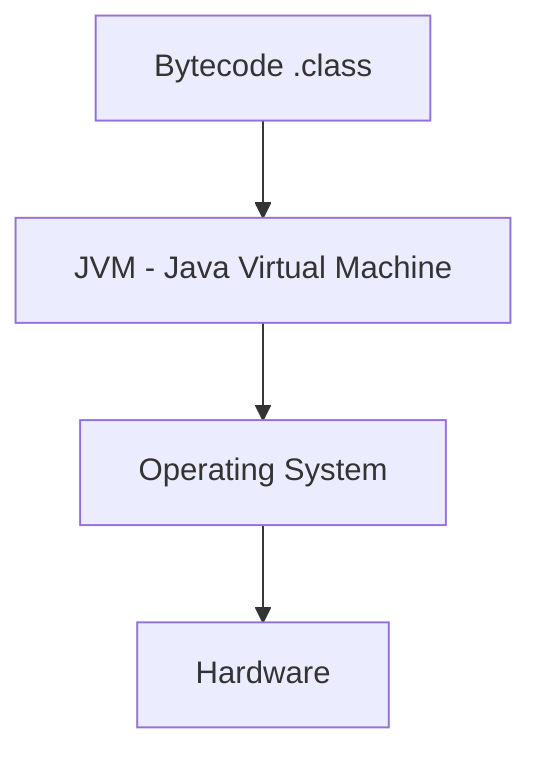
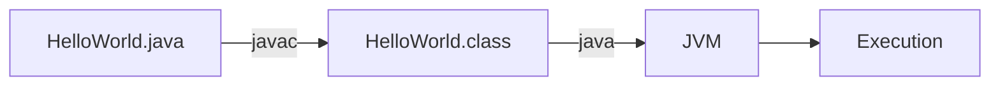
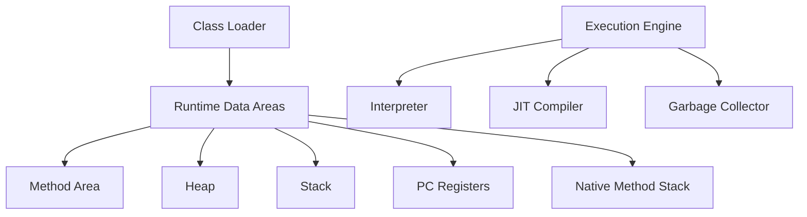
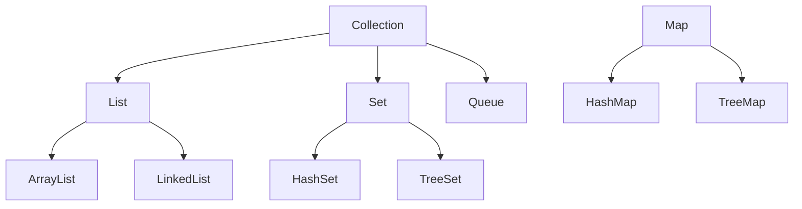

# Introduction to Java

<div class="pt-12">
  <span @click="$slidev.nav.next" class="px-2 py-1 rounded cursor-pointer" hover="bg-white bg-opacity-10">
    Your journey into Java programming begins here <carbon:arrow-right class="inline"/>
  </span>
</div>

---

# Contact Info

<div class="grid grid-cols-2 gap-8">
<div>

**Ken Kousen**<br>
Kousen IT, Inc.

- ken.kousen@kousenit.com
- http://www.kousenit.com
- http://kousenit.org (blog)

</div>
<div>

**Social Media:**
- [@kenkousen](https://twitter.com/kenkousen) (Twitter)
- [@kousenit.com](https://bsky.app/profile/kousenit.com) (Bluesky)
- [LinkedIn](https://www.linkedin.com/in/kenkousen/)

**Newsletter:**
- [Tales from the jar side](https://kenkousen.substack.com)
- [YouTube Channel](https://youtube.com/@talesfromthejarside)

</div>
</div>

---

# Course Schedule

<div class="grid grid-cols-2 gap-8">
<div>

## Morning (150 minutes)
- Java Basics (90 min)
  - Values, Variables, Methods
  - String Handling & Math
  - Flow Control
- Introduction to OO (60 min)
  - Classes & Objects
  - Wrapper Types & Arrays

</div>
<div>

## Afternoon (150 minutes)
- JVM and Tooling (60 min)
  - IntelliJ IDEA
  - JVM & Java Lifecycle
- Java Types & Collections (90 min)
  - Inheritance & Interfaces
  - Java Collections

</div>
</div>

---

# What is Java?

<div class="flex items-center justify-between">
<div>

<v-clicks>

- Object-oriented programming language
- Platform independent ("Write Once, Run Anywhere")
- Strongly typed
- Automatic memory management
- Rich standard library
- Used for enterprise, Android, web backends, and more

</v-clicks>

</div>
<div class="w-1/3">

</div>
</div>

---

# Java Compilation Process

<div class="flex items-center justify-between">
<div>



</div>
<div class="w-1/2">

<v-clicks>

- Java source code is compiled to bytecode
- Bytecode is platform-independent
- JVM executes bytecode on specific platforms

</v-clicks>

</div>
</div>

---

# JVM Platform Architecture  

<div class="flex items-center justify-between">
<div>



</div>
<div class="w-1/2">

<v-clicks>

- JVM provides abstraction layer
- Same bytecode runs on different platforms
- "Write Once, Run Anywhere" (WORA)

</v-clicks>

</div>
</div>

---

# JShell: Interactive Java

Starting JShell:
```bash
$ jshell
|  Welcome to JShell -- Version 17
|  For an introduction type: /help intro

jshell>
```

<v-clicks>

- REPL (Read-Eval-Print Loop)
- Great for learning and experimentation
- No need for class or main method
- Built into Java since version 9

</v-clicks>

---

# Values and Variables in JShell

```java
jshell> int x = 10
x ==> 10

jshell> double pi = 3.14159
pi ==> 3.14159

jshell> String message = "Hello, Java!"
message ==> "Hello, Java!"

jshell> boolean isReady = true
isReady ==> true
```

<v-clicks>

- Type declaration required
- Assignment with `=`
- Semicolons optional in JShell

</v-clicks>

---

# Primitive Types in Java

<div class="grid grid-cols-2 gap-8">
<div>

| Type | Size | Range |
|------|------|-------|
| `byte` | 8 bits | -128 to 127 |
| `short` | 16 bits | -32K to 32K |
| `int` | 32 bits | -2³¹ to 2³¹-1 |
| `long` | 64 bits | -2⁶³ to 2⁶³-1 |

</div>
<div>

| Type | Size | Range |
|------|------|-------|
| `float` | 32 bits | ±3.4×10³⁸ |
| `double` | 64 bits | ±1.7×10³⁰⁸ |
| `char` | 16 bits | Unicode |
| `boolean` | 1 bit* | true/false |

</div>
</div>

*Size is JVM-dependent

---

# Simple Methods in JShell

```java
jshell> int add(int a, int b) {
   ...>     return a + b;
   ...> }
|  created method add(int,int)

jshell> add(5, 3)
$2 ==> 8

jshell> double calculateArea(double radius) {
   ...>     return Math.PI * radius * radius;
   ...> }
|  created method calculateArea(double)

jshell> calculateArea(5.0)
$4 ==> 78.53981633974483
```

---

# Exercise: Writing Simple Functions

Try these in JShell:

1. Write a function `multiply` that takes two integers and returns their product
2. Write a function `isEven` that returns true if a number is even
3. Write a function `celsiusToFahrenheit` that converts temperatures

<div class="mt-8 text-sm text-gray-500">

Time: 10 minutes

</div>

---

# String Basics

```java
jshell> String name = "Java"
name ==> "Java"

jshell> name.length()
$2 ==> 4

jshell> name.toUpperCase()
$3 ==> "JAVA"

jshell> name.toLowerCase()
$4 ==> "java"

jshell> name.charAt(0)
$5 ==> 'J'
```

Strings are immutable - methods return new strings

---

# String Concatenation

```java
jshell> String first = "Hello"
first ==> "Hello"

jshell> String second = "World"
second ==> "World"

jshell> first + " " + second
$3 ==> "Hello World"

jshell> String result = first.concat(" ").concat(second)
result ==> "Hello World"

jshell> "Number: " + 42
$5 ==> "Number: 42"
```

---

# Common String Methods

```java
jshell> String text = "  Hello Java  "

jshell> text.trim()
$2 ==> "Hello Java"

jshell> text.contains("Java")
$3 ==> true

jshell> text.replace("Java", "World")
$4 ==> "  Hello World  "

jshell> "apple,banana,orange".split(",")
$5 ==> String[3] { "apple", "banana", "orange" }
```

---

# Math Functions

```java
jshell> Math.sqrt(16)
$1 ==> 4.0

jshell> Math.pow(2, 8)
$2 ==> 256.0

jshell> Math.max(10, 20)
$3 ==> 20

jshell> Math.random()
$4 ==> 0.7264896551724027

jshell> Math.round(3.7)
$5 ==> 4
```

---

# Exercise: Working with Strings

In JShell, try:

1. Create a full name from first and last name variables
2. Check if an email contains "@" symbol
3. Extract the domain from an email address
4. Count the number of words in a sentence

<div class="mt-8 text-sm text-gray-500">

Time: 10 minutes

</div>

---

# If Statements

```java
int age = 18;

if (age >= 18) {
    System.out.println("You can vote!");
} else {
    System.out.println("Too young to vote.");
}

// Multiple conditions
if (age < 13) {
    System.out.println("Child");
} else if (age < 20) {
    System.out.println("Teenager");
} else {
    System.out.println("Adult");
}
```

---

# Comparison Operators

| Operator | Meaning |
|----------|---------|
| `==` | Equal to |
| `!=` | Not equal to |
| `>` | Greater than |
| `<` | Less than |
| `>=` | Greater than or equal |
| `<=` | Less than or equal |

Logical operators: `&&` (AND), `||` (OR), `!` (NOT)

---

# For Loops

```java
// Traditional for loop
for (int i = 0; i < 5; i++) {
    System.out.println("Count: " + i);
}

// Enhanced for loop (for-each)
int[] numbers = {1, 2, 3, 4, 5};
for (int num : numbers) {
    System.out.println(num);
}

// Loop with step
for (int i = 0; i <= 10; i += 2) {
    System.out.println(i); // 0, 2, 4, 6, 8, 10
}
```

---

# While Loops

```java
// while loop
int count = 0;
while (count < 5) {
    System.out.println("Count: " + count);
    count++;
}

// do-while loop
int num = 0;
do {
    System.out.println("Number: " + num);
    num++;
} while (num < 3);
```

<v-clicks>

- `while` checks condition first
- `do-while` executes at least once

</v-clicks>

---

# Break and Continue

```java
// break - exit the loop
for (int i = 0; i < 10; i++) {
    if (i == 5) {
        break;
    }
    System.out.println(i); // 0, 1, 2, 3, 4
}

// continue - skip to next iteration
for (int i = 0; i < 5; i++) {
    if (i == 2) {
        continue;
    }
    System.out.println(i); // 0, 1, 3, 4
}
```

---

# Code-Along: FizzBuzz

Classic programming exercise:

- Print numbers 1 to 100
- For multiples of 3, print "Fizz"
- For multiples of 5, print "Buzz"
- For multiples of both, print "FizzBuzz"

```java
for (int i = 1; i <= 100; i++) {
    // Your code here
}
```

---

# Q&A Session

<div class="flex items-center justify-center h-full">
<div class="text-center">

## Questions about Java Basics?

<div class="text-left mt-4">

- Values and Variables
- String Handling
- Math Functions
- Flow Control

</div>

</div>
</div>

---

# Break Time

<div class="flex items-center justify-center h-full">
<div class="text-center">

## 15 Minute Break

<div class="mt-8">

</div>

</div>
</div>

---

# Introduction to Object-Oriented Programming

<div class="flex items-center justify-between">
<div>

<v-clicks>

- Objects represent real-world entities
- Classes are blueprints for objects
- Encapsulation: bundling data and methods
- Key concepts:
  - State (fields/attributes)
  - Behavior (methods)
  - Identity (unique instance)

</v-clicks>

</div>
<div class="w-1/3">

</div>
</div>

---

# Creating a Simple Class

```java
public class Person {
    // Fields (state)
    String name;
    int age;
    
    // Constructor
    public Person(String name, int age) {
        this.name = name;
        this.age = age;
    }
    
    // Method (behavior)
    public void introduce() {
        System.out.println("Hi, I'm " + name + 
                         " and I'm " + age + " years old.");
    }
}
```

---

# Using Classes in JShell

```java
jshell> class Car {
   ...>     String make;
   ...>     String model;
   ...>     int year;
   ...> }
|  created class Car

jshell> Car myCar = new Car()
myCar ==> Car@1a2b3c4d

jshell> myCar.make = "Toyota"
$3 ==> "Toyota"

jshell> myCar.model = "Camry"
$4 ==> "Camry"

jshell> myCar.year = 2022
$5 ==> 2022
```

---

# Objects and References

```java
Person person1 = new Person("Alice", 25);
Person person2 = new Person("Bob", 30);
Person person3 = person1; // Reference copy

person3.age = 26;
System.out.println(person1.age); // 26
```

<v-clicks>

- Variables hold references to objects
- Multiple references can point to same object
- Assignment copies the reference, not the object

</v-clicks>

---

# The null Reference

```java
String text = null; // No object

// Checking for null
if (text != null) {
    System.out.println(text.length());
} else {
    System.out.println("text is null");
}

// NullPointerException
String s = null;
s.length(); // Error!
```

Always check for null before using an object

---

# Exercise: Writing Simple Classes

Create these classes in JShell:

1. `BankAccount` with balance and deposit/withdraw methods
2. `Rectangle` with width, height, and area calculation
3. `Student` with name, grades array, and average grade method

<div class="mt-8 text-sm text-gray-500">

Time: 15 minutes

</div>

---

# Wrapper Types

<div class="grid grid-cols-2 gap-8">
<div>

| Primitive | Wrapper Class |
|-----------|---------------|
| `int` | `Integer` |
| `double` | `Double` |
| `boolean` | `Boolean` |
| `char` | `Character` |

</div>
<div>

| Primitive | Wrapper Class |
|-----------|---------------|
| `long` | `Long` |
| `float` | `Float` |
| `byte` | `Byte` |
| `short` | `Short` |

</div>
</div>

Objects that contain primitive values

---

# Autoboxing and Unboxing

```java
// Autoboxing - primitive to wrapper
Integer num = 42; // int -> Integer

// Unboxing - wrapper to primitive  
int value = num; // Integer -> int

// In collections
List<Integer> numbers = new ArrayList<>();
numbers.add(10); // autoboxing
int first = numbers.get(0); // unboxing
```

Automatic conversion between primitives and wrappers

---

# Useful Wrapper Methods

```java
// Parsing strings
int num = Integer.parseInt("123");
double d = Double.parseDouble("3.14");

// Converting to strings
String s1 = Integer.toString(42);
String s2 = Double.toString(3.14);

// Min/Max values
System.out.println(Integer.MAX_VALUE); // 2147483647
System.out.println(Integer.MIN_VALUE); // -2147483648

// Comparing
Integer.compare(10, 20); // -1
```

---

# Arrays

```java
// Declaration and initialization
int[] numbers = new int[5]; // [0, 0, 0, 0, 0]
String[] names = {"Alice", "Bob", "Charlie"};

// Accessing elements
numbers[0] = 10;
System.out.println(names[1]); // "Bob"

// Array length
System.out.println(numbers.length); // 5

// Iterating
for (int i = 0; i < numbers.length; i++) {
    System.out.println(numbers[i]);
}
```

---

# Array Operations

```java
// Enhanced for loop
int[] scores = {85, 90, 78, 92, 88};
for (int score : scores) {
    System.out.println(score);
}

// Finding sum
int sum = 0;
for (int score : scores) {
    sum += score;
}
double average = (double) sum / scores.length;

// Array of objects
Person[] people = new Person[3];
people[0] = new Person("Alice", 25);
```

---

# Multi-dimensional Arrays

```java
// 2D array (matrix)
int[][] matrix = new int[3][3];
matrix[0][0] = 1;
matrix[0][1] = 2;

// Initialize with values
int[][] grid = {
    {1, 2, 3},
    {4, 5, 6},
    {7, 8, 9}
};

// Iterate through 2D array
for (int i = 0; i < grid.length; i++) {
    for (int j = 0; j < grid[i].length; j++) {
        System.out.print(grid[i][j] + " ");
    }
    System.out.println();
}
```

---

# Exercise: Classes and Arrays

1. Create a `GradeBook` class that:
   - Stores student names and their grades
   - Calculates class average
   - Finds highest and lowest grades

2. Create a method that reverses an array

3. Create a tic-tac-toe board using 2D array

<div class="mt-8 text-sm text-gray-500">

Time: 15 minutes

</div>

---

# Q&A Session

<div class="flex items-center justify-center h-full">
<div class="text-center">

## Questions about OO Concepts?

<div class="text-left mt-4">

- Classes and Objects
- References and null
- Wrapper Types
- Arrays

</div>

</div>
</div>

---

# Break Time

<div class="flex items-center justify-center h-full">
<div class="text-center">

## 15 Minute Break

<div class="mt-8">

</div>

</div>
</div>

---

# The JVM and Tooling

<div class="grid grid-cols-2 gap-8">
<div>

## This Section Covers:
- IntelliJ IDEA basics
- Java compilation process
- JVM architecture
- Command-line tools

</div>
<div>

## Why It Matters:
- Professional development
- Understanding Java ecosystem
- Debugging capabilities
- Performance insights

</div>
</div>

---

# IntelliJ IDEA Overview

<div class="flex items-center justify-between">
<div>

<v-clicks>

- Industry-standard Java IDE
- Smart code completion
- Integrated debugging
- Refactoring tools
- Version control integration
- Built-in terminal

</v-clicks>

</div>
<div class="w-1/3">

</div>
</div>

---

# Creating a Project in IntelliJ

1. File → New → Project
2. Select Java
3. Choose project SDK (Java 17)
4. Create project structure:
   ```
   MyProject/
   ├── src/           # Source files
   ├── out/           # Compiled classes
   └── .idea/         # IDE settings
   ```

---

# IntelliJ Key Features

```java
// Code completion (Ctrl+Space)
String name = "Java";
name. // Shows all String methods

// Generate code (Alt+Insert)
// - Constructors
// - Getters/Setters
// - toString(), equals(), hashCode()

// Refactoring (Shift+F6)
// - Rename variables/methods/classes
// - Extract method/variable
// - Inline
```

---

# IntelliJ Productivity Tips

<div class="grid grid-cols-2 gap-8">
<div>

**Editing:**
| Shortcut | Action |
|----------|--------|
| `Ctrl+Space` | Code completion |
| `Alt+Enter` | Quick fix |
| `Ctrl+/` | Comment line |
| `Ctrl+D` | Duplicate line |
| `Ctrl+Y` | Delete line |

</div>
<div>

**Running & Debugging:**
| Shortcut | Action |
|----------|--------|
| `Shift+F10` | Run |
| `Shift+F9` | Debug |
| `Ctrl+Shift+F10` | Run current file |

</div>
</div>

---

# Exercise: First IntelliJ Project

Create a new project and:

1. Create a `Main` class with main method
2. Add a `Calculator` class with basic operations
3. Use code generation for constructor
4. Practice debugging with breakpoints

<div class="mt-8 text-sm text-gray-500">

Time: 15 minutes

</div>

---

# Java Compilation Process



```bash
# Compile
javac HelloWorld.java

# Run
java HelloWorld
```

---

# JVM Architecture



---

# Key JVM Components

<v-clicks>

- **Class Loader**: Loads .class files
- **Heap**: Objects live here
- **Stack**: Method calls and local variables
- **Method Area**: Class metadata, constants
- **Execution Engine**: Runs bytecode
- **Garbage Collector**: Automatic memory management

</v-clicks>

---

# Command-Line Tools

```bash
# Compile
javac MyClass.java

# Run
java MyClass

# Compile with classpath
javac -cp lib/dependency.jar MyClass.java

# Run with classpath
java -cp .:lib/dependency.jar MyClass

# View bytecode
javap -c MyClass

# JShell
jshell
```

---

# Java Command Options

```bash
# Memory settings
java -Xms512m -Xmx2g MyApp

# Enable assertions
java -ea MyApp

# System properties
java -Dfile.encoding=UTF-8 MyApp

# Verbose output
java -verbose:gc MyApp
```

Common options you'll encounter

---

# Exercise: Command-Line Tools

Using terminal/command prompt:

1. Compile and run a simple Java program
2. Use `javap` to examine bytecode
3. Run with different heap sizes
4. Create a multi-file program and compile

<div class="mt-8 text-sm text-gray-500">

Time: 10 minutes

</div>

---

# Q&A Session

<div class="flex items-center justify-center h-full">
<div class="text-center">

## Questions about JVM and Tooling?

<div class="text-left mt-4">

- IntelliJ IDEA
- Compilation process
- JVM architecture
- Command-line tools

</div>

</div>
</div>

---

# Break Time

<div class="flex items-center justify-center h-full">
<div class="text-center">

## 15 Minute Break

<div class="mt-8">

</div>

</div>
</div>

---

# Java Types and Collections

<div class="grid grid-cols-2 gap-8">
<div>

## Core OOP Concepts:
- Inheritance
- Interfaces
- Access modifiers
- Abstract classes

</div>
<div>

## Collections Framework:
- Lists
- Sets
- Maps
- Choosing the right collection

</div>
</div>

---

# Inheritance

```java
public class Animal {
    protected String name;
    
    public Animal(String name) {
        this.name = name;
    }
    
    public void eat() {
        System.out.println(name + " is eating");
    }
}

public class Dog extends Animal {
    public Dog(String name) {
        super(name); // Call parent constructor
    }
    
    public void bark() {
        System.out.println(name + " says woof!");
    }
}
```

---

# Using Inheritance

```java
Dog myDog = new Dog("Buddy");
myDog.eat();   // Inherited method
myDog.bark();  // Dog-specific method

// Polymorphism
Animal animal = new Dog("Max");
animal.eat();  // Works
// animal.bark(); // Compile error - not in Animal
```

<v-clicks>

- Child class inherits parent's members
- Can add new methods/fields
- Can override parent methods

</v-clicks>

---

# Method Overriding

```java
public class Cat extends Animal {
    public Cat(String name) {
        super(name);
    }
    
    @Override
    public void eat() {
        System.out.println(name + " is eating delicately");
    }
    
    public void meow() {
        System.out.println(name + " says meow!");
    }
}
```

`@Override` annotation helps catch errors

---

# Access Modifiers

<div class="grid grid-cols-2 gap-8">
<div>

| Modifier | Class | Package | Subclass | All |
|----------|-------|---------|----------|-----|
| `public` | ✓ | ✓ | ✓ | ✓ |
| `protected` | ✓ | ✓ | ✓ | ✗ |
| (default) | ✓ | ✓ | ✗ | ✗ |
| `private` | ✓ | ✗ | ✗ | ✗ |

</div>
<div>

**Key Points:**
- `public` - Accessible everywhere
- `protected` - Package + subclasses
- Default - Package only
- `private` - Class only

Control visibility of classes, methods, and fields

</div>
</div>

---

# Encapsulation Example

```java
public class BankAccount {
    private double balance; // Private field
    
    public BankAccount(double initialBalance) {
        this.balance = initialBalance;
    }
    
    // Public getter
    public double getBalance() {
        return balance;
    }
    
    // Public method with validation
    public void deposit(double amount) {
        if (amount > 0) {
            balance += amount;
        }
    }
}
```

---

# Interfaces

```java
public interface Drawable {
    void draw(); // Abstract method
    
    // Default method (Java 8+)
    default void print() {
        System.out.println("Printing...");
    }
}

public class Circle implements Drawable {
    @Override
    public void draw() {
        System.out.println("Drawing a circle");
    }
}
```

Define contracts that classes must follow

---

# Multiple Interfaces

```java
public interface Movable {
    void move(int x, int y);
}

public interface Resizable {
    void resize(double factor);
}

public class Shape implements Drawable, Movable, Resizable {
    @Override
    public void draw() { /* implementation */ }
    
    @Override
    public void move(int x, int y) { /* implementation */ }
    
    @Override
    public void resize(double factor) { /* implementation */ }
}
```

---

# Abstract Classes

```java
public abstract class Vehicle {
    protected String brand;
    
    public Vehicle(String brand) {
        this.brand = brand;
    }
    
    // Abstract method - must be implemented
    public abstract void start();
    
    // Concrete method - can be used as-is
    public void stop() {
        System.out.println("Vehicle stopped");
    }
}
```

Partial implementation + contract

---

# Exercise: Inheritance Hierarchies

Create a hierarchy:

1. Base class `Employee` with name and salary
2. Subclass `Manager` with team size
3. Subclass `Developer` with programming language
4. Interface `Payable` with `calculateBonus()` method

<div class="mt-8 text-sm text-gray-500">

Time: 15 minutes

</div>

---

# Java Collections Framework



---

# Lists

```java
// ArrayList - dynamic array
List<String> names = new ArrayList<>();
names.add("Alice");
names.add("Bob");
names.add(0, "Charlie"); // Insert at index

// Access elements
String first = names.get(0);
names.set(1, "Robert"); // Replace

// Remove
names.remove("Alice");
names.remove(0); // By index

// Iterate
for (String name : names) {
    System.out.println(name);
}
```

---

# Lists vs Sets

<div class="grid grid-cols-2 gap-8">
<div>

**Lists:**
- Ordered collection
- Allow duplicates
- Access by index
- Common: `ArrayList`

```java
List<String> names = new ArrayList<>();
names.add("Alice");
names.add("Bob");
names.add("Alice"); // Allowed
// [Alice, Bob, Alice]
```

</div>
<div>

**Sets:**
- No duplicates
- May or may not be ordered
- No index access
- Common: `HashSet`, `TreeSet`

```java
Set<String> names = new HashSet<>();
names.add("Alice");
names.add("Bob");
names.add("Alice"); // Ignored
// [Alice, Bob] (order not guaranteed)
```

</div>
</div>

---

# Sets

```java
// HashSet - no duplicates, no order
Set<Integer> numbers = new HashSet<>();
numbers.add(5);
numbers.add(3);
numbers.add(5); // Ignored - duplicate

// TreeSet - sorted
Set<String> sortedWords = new TreeSet<>();
sortedWords.add("banana");
sortedWords.add("apple");
sortedWords.add("cherry");
// Stored as: [apple, banana, cherry]

// Check membership
if (numbers.contains(3)) {
    System.out.println("Found 3");
}
```

---

# Maps

```java
// HashMap - key-value pairs
Map<String, Integer> ages = new HashMap<>();
ages.put("Alice", 25);
ages.put("Bob", 30);
ages.put("Charlie", 35);

// Access values
Integer aliceAge = ages.get("Alice"); // 25
Integer unknown = ages.get("David"); // null

// Iterate
for (Map.Entry<String, Integer> entry : ages.entrySet()) {
    System.out.println(entry.getKey() + ": " + entry.getValue());
}

// Check existence
if (ages.containsKey("Bob")) {
    System.out.println("Bob's age: " + ages.get("Bob"));
}
```

---

# Useful Collection Methods

```java
// List operations
List<Integer> nums = Arrays.asList(3, 1, 4, 1, 5);
Collections.sort(nums); // [1, 1, 3, 4, 5]
Collections.reverse(nums); // [5, 4, 3, 1, 1]
int max = Collections.max(nums); // 5

// Convert array to list
String[] array = {"a", "b", "c"};
List<String> list = Arrays.asList(array);

// List to array
String[] newArray = list.toArray(new String[0]);

// Unmodifiable collections
List<String> immutable = Collections.unmodifiableList(list);
```

---

# Choosing the Right Collection

<div class="grid grid-cols-2 gap-8">
<div>

**Basic Collections:**
| Need | Use |
|------|-----|
| Ordered, duplicates | `ArrayList` |
| Fast insert/delete | `LinkedList` |
| No duplicates | `HashSet` |
| Sorted, no duplicates | `TreeSet` |

</div>
<div>

**Advanced Collections:**
| Need | Use |
|------|-----|
| Key-value pairs | `HashMap` |
| Sorted key-value | `TreeMap` |
| Thread-safe list | `CopyOnWriteArrayList` |
| Thread-safe map | `ConcurrentHashMap` |

</div>
</div>

---

# Exercise: Working with Collections

1. Create a phone book using HashMap
2. Remove duplicates from a list using Set
3. Count word frequency in a sentence
4. Implement a simple shopping cart

<div class="mt-8 text-sm text-gray-500">

Time: 15 minutes

</div>

---

# Common Patterns

```java
// Safe map access
Map<String, String> map = new HashMap<>();
String value = map.getOrDefault("key", "default");

// Iterate and remove
Iterator<String> it = list.iterator();
while (it.hasNext()) {
    String item = it.next();
    if (item.startsWith("remove")) {
        it.remove();
    }
}

// Collection to stream (Java 8+)
list.stream()
    .filter(s -> s.length() > 5)
    .forEach(System.out::println);
```

---

# Q&A Session

<div class="flex items-center justify-center h-full">
<div class="text-center">

## Final Questions?

<div class="text-left mt-4">

- Inheritance and Interfaces
- Access Control
- Collections Framework
- Best Practices

</div>

</div>
</div>

---

# Course Wrap-Up

<div class="grid grid-cols-2 gap-8">
<div>

## What We Covered:
✓ Java syntax and basics  
✓ Object-oriented programming  
✓ JVM and development tools  
✓ Collections framework  

</div>
<div>

## Next Steps:
- Practice with real projects
- Explore Java 8+ features
- Learn frameworks (Spring, etc.)
- Build something!

</div>
</div>

---

# Resources

<div class="grid grid-cols-2 gap-8">
<div>

## Official Documentation
- https://docs.oracle.com/en/java/
- https://dev.java/learn/

## Practice Sites
- https://www.hackerrank.com/domains/java
- https://www.codewars.com
- https://leetcode.com

</div>
<div>

## Books
- "Modern Java Recipes" (Kousen)
- "Head First Java" (Sierra & Bates)
- "Effective Java" (Bloch)
- "Java: The Complete Reference" (Schildt)

</div>
</div>

---

# Thank You!

<div class="text-center">

## Happy Coding with Java!

**Kenneth Kousen**  
*Kousen IT, Inc.*

<carbon-link /> [kousenit.com](https://kousenit.com) | <carbon-logo-github /> [kousen](https://github.com/kousen) | [@kousenit.com](https://bsky.app/profile/kousenit.com)

<div class="mt-8">

</div>

</div>